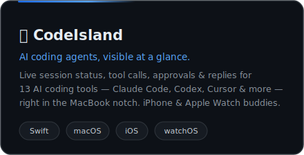
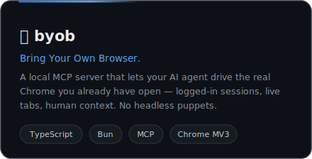

  

 

<table>
  <tr>
    <td width="50%" align="center" valign="top">
      
      

        
        &nbsp;
        <a href="https://github.com/wxtsky/CodeIsland#installation"><b>Install&nbsp;→</b></a>
      

    </td>
    <td width="50%" align="center" valign="top">
      
      

        
        &nbsp;
        <a href="https://github.com/wxtsky/byob#install"><b>Get&nbsp;started&nbsp;→</b></a>
      

    </td>
  </tr>
</table>

  native apps × AI agents × the open web&nbsp;&nbsp;·&nbsp;&nbsp;在原生应用、AI Agent 与开放网络的交界处做产品

